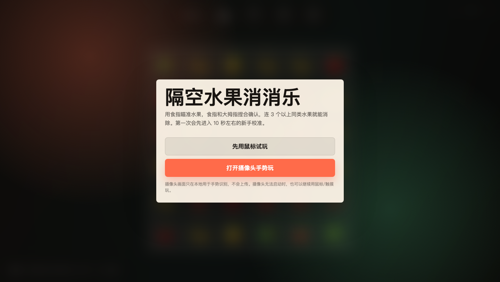
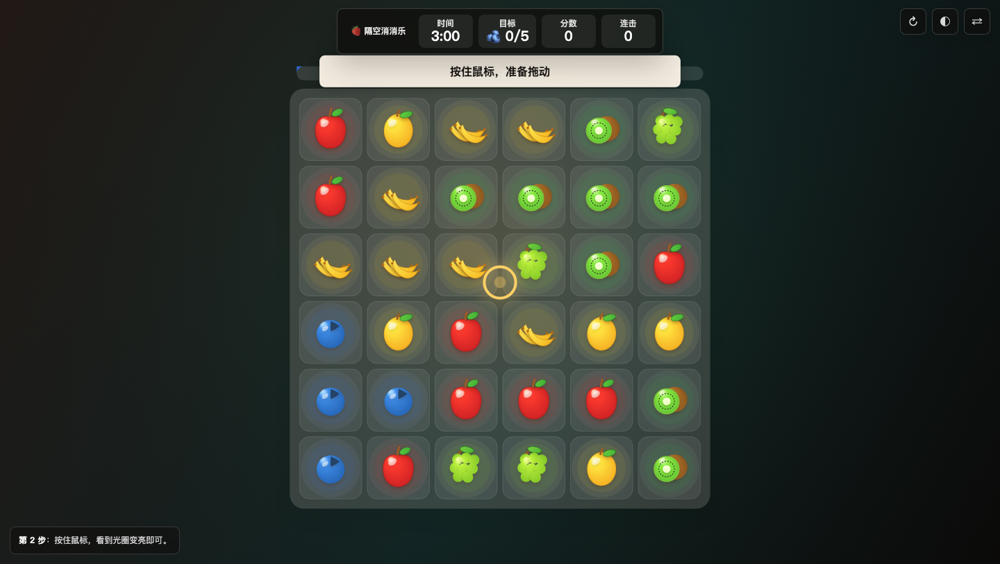
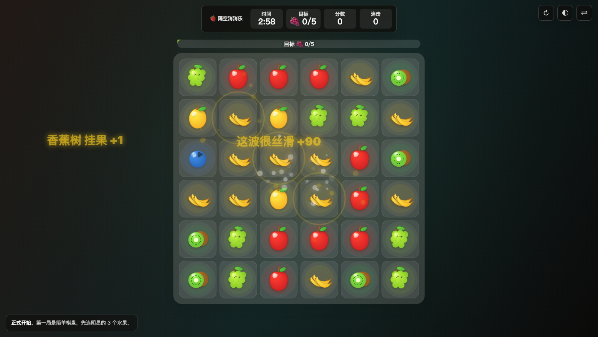
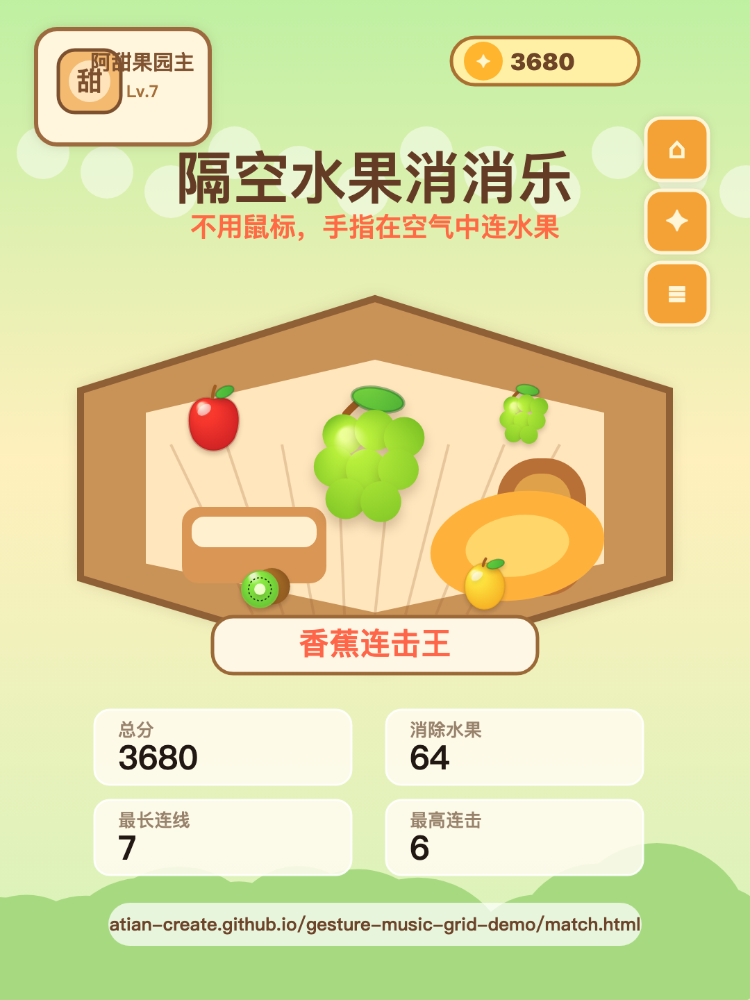

# 阿甜 Skill - 空间水果消消乐

把水果消消乐做成一个可以用手势玩的 3 分钟街机网页。

这个项目是「隔空小游戏」系列的第二个实验：第一个是站起来挥手切水果，这一个更像小游戏，玩家可以用鼠标、触摸，或者打开摄像头，用食指和大拇指在空中连线消除水果。

> 久坐之后，不一定要先打开一个很重的健身 App。也可以先站起来，玩 3 分钟。

## 在线体验

- 体验入口：`https://atian-create.github.io/gesture-music-grid-demo/match.html`
- GitHub：`https://github.com/atian-create/gesture-music-grid-demo`

## 截图









## 它有什么特别

- **空间消消乐**：用食指瞄准水果，食指和大拇指碰在一起就是选中，松开就爆开；鼠标模式则是按住拖动、松开消除。
- **先鼠标试玩，再打开摄像头**：首屏不会自动请求摄像头，玩家可以先用鼠标理解玩法。
- **鼠标转手势教学**：鼠标试玩 30 秒后会让玩家选择继续鼠标或打开摄像头；切到手势后有 30 秒接管教学。
- **3 分钟街机局**：倒计时、目标水果、分数、连击都在顶部，适合录屏和截图。
- **新手教学**：先瞄准、再捏合、最后练习横着/竖着/斜着连线；选中格子会高亮，拖过路径会更粗更亮。
- **道具反馈**：连击会生成彩虹道具，长连会生成炸弹，目标水果完成后会给果园奖励。
- **本地手势识别**：摄像头画面只在本地用于识别，不上传；页面会提示手太远、太近或没入镜，并建议 40-70cm 距离。
- **小红书战绩图**：结束后可以生成 1080x1440 竖版战绩图，重点强调“空间远程玩”和“手指在空气中连水果”，更适合直接作为发布素材。

## 文件结构

```text
.
├── index.html          # 水果音乐九宫格原型
├── match.html          # 空间水果消消乐主入口
├── arcade.html         # Boss 战 / 节奏器版本
├── assets/
│   └── atian-cartoon.png
└── docs/images/        # 开源展示截图
```

## 本地运行

```bash
python3 -m http.server 5175
```

然后打开：

```text
http://localhost:5175/match.html
```

## 技术说明

- 静态 HTML + Canvas
- MediaPipe Hands 做手势识别
- 鼠标 / 触摸 fallback
- 无后端、无账号、无上传

## 适合怎么改

- 换成自己的主题水果、城市、节日元素
- 改成小朋友专注力训练、肩颈活动、课间小游戏
- 把结束页战绩图做成更强的小红书模板
- 接到自己的 Skill 流程里，让 AI 自动生成同类体感小游戏

## License

MIT
